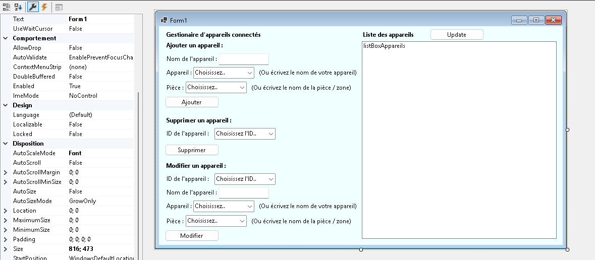
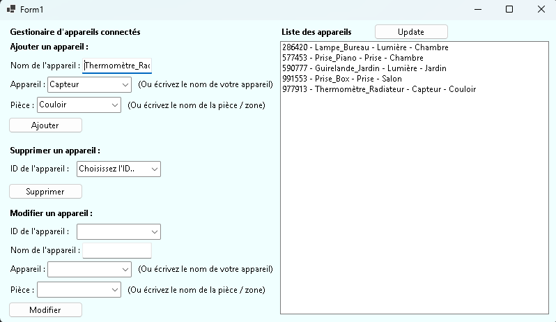
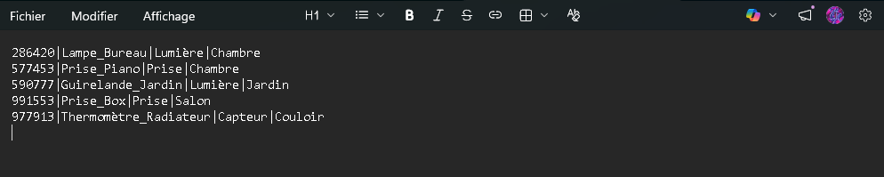

# Application de Gestion d'Appareils Connectés
### Projet C# — BTS SIO

---

## Présentation

L'objectif de ce projet était de réaliser une application de gestion utilisant l'écriture et la lecture dans un fichier `.txt` pour simuler une base de données.

Le sujet étant libre, j'ai choisi de développer une **application de gestion d'appareils connectés** (type domotique), permettant d'ajouter, modifier et supprimer des appareils associés à des pièces d'un logement.

Pour prendre en main certaines syntaxes, j'ai consulté quelques pages de documentation. Afin de faciliter la lecture du projet, des commentaires sont présents tout au long du code, parfois accompagnés d'explications et de citations de sources.

---

## Interface

Voici l'interface telle qu'elle apparaît dans le designer Rider (JetBrains) :



---

## Fonctionnalités

- **Ajouter** un appareil —> un ID aléatoire à 6 chiffres lui est automatiquement attribué
- **Supprimer** un appareil via son ID
- **Modifier** un appareil existant via son ID
- **Lister** tous les appareils enregistrés en temps réel

Une fois l'application ouverte, il est possible d'ajouter des appareils. Un ID aléatoire leur est attribué à chaque enregistrement :



---

## Stockage des données

Les appareils sont enregistrés ligne par ligne dans un fichier `Appareils.txt`, selon le format suivant :

```
ID|NomAppareil|TypeAppareil|Pièce
```

Voici un aperçu du fichier après plusieurs ajouts :
>


---

## Limites

> Ce projet était un **exercice de cours** (comme le suggère le nom du repo). L'application n'a pas vocation à être utilisée.

Parmi les limitations identifiées :

- Aucune vérification contre les doublons d'ID (deux appareils pourraient théoriquement avoir le même)
- Pas de tri dans la ListBox
- Les champs TextBox ne se vident pas automatiquement après une action (ajout / suppression / édition)

Cette base constituait cependant un bon sujet d'entraînement pour prendre en main les fondamentaux de C# : classes, méthodes et lecture/écriture de fichiers.

---

Bonne lecture !
